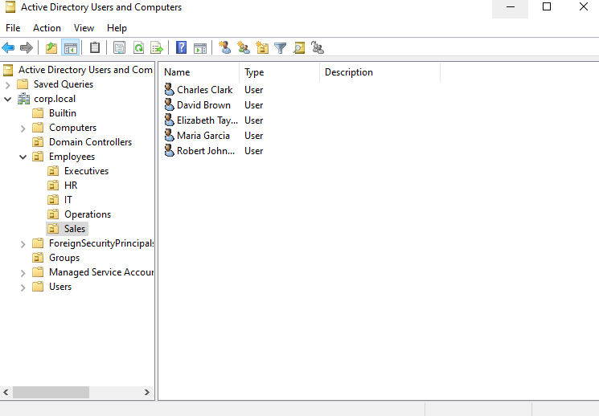
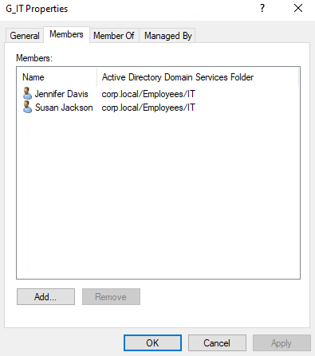

# Project: AD-001-Identity-Population
**Date:** February 2026
**Platform:** Windows Server 2022 (PowerShell ISE)

## 1. Project Overview
With the Active Directory infrastructure established (AD-000), the environment was functionally empty. To simulate a realistic enterprise environment for security monitoring, I needed to populate the directory with a diverse workforce. Instead of manually creating users one by one, I utilized **PowerShell Automation** to architect a standard Organizational Unit (OU) hierarchy, generate Security Groups, and onboard 20+ synthetic users with realistic attributes.

## 2. Directory Design
* **Root:** `corp.local`
* **Hierarchy Strategy:**
    * **Employees (Parent OU):** Container for all human users to allow for broad Group Policy application.
    * **Departmental OUs:** Sub-containers (IT, HR, Sales, Executives, Operations) to allow for department-specific policies.
* **Security Groups:**
    * Created Global Groups (e.g., `G_Sales`, `G_IT`) mapped 1:1 with departments for Role-Based Access Control (RBAC).
* **High-Value Targets:**
    * Created specific service accounts (e.g., `hr.admin`) to serve as "honey accounts" for future credential theft labs.

## 3. Configuration Details (The Automation Script)
I developed a PowerShell script to iterate through arrays of names and departments, automating the provisioning process.

**Key Script Logic:**
1.  **Array Handling:** Defined a list of `Names` and `Departments` to loop through.
2.  **Conditional Checks:** Used `Get-ADUser` inside an `if` statement to prevent duplicate errors if the script is re-run.
3.  **Attribute Assignment:** Automatically generated UserPrincipalNames (`firstname.lastname@corp.local`) and added users to their respective Department Security Groups immediately upon creation.

### The Deployment Script
```powershell
$DomainDN = "DC=corp,DC=local"
$CompanyOUs = @("IT", "HR", "Sales", "Executives", "Operations")
$Password = ConvertTo-SecureString "P@ssw0rd123!" -AsPlainText -Force

# 1. Create Structure
New-ADOrganizationalUnit -Name "Employees" -Path $DomainDN -ErrorAction SilentlyContinue
foreach ($OU in $CompanyOUs) {
    New-ADOrganizationalUnit -Name $OU -Path "OU=Employees,$DomainDN" -ErrorAction SilentlyContinue
    New-ADGroup -Name "G_$OU" -GroupScope Global -Path "OU=Groups,$DomainDN" -ErrorAction SilentlyContinue
}

# 2. Loop & Create Users
$Names = @("James.Smith", "Maria.Garcia", "Robert.Johnson") # (Truncated list)
foreach ($Name in $Names) {
    $Dept = $CompanyOUs[(Get-Random -Maximum $CompanyOUs.Count)]
    New-ADUser -Name $Name -SamAccountName $Name -Path "OU=$Dept,OU=Employees,$DomainDN" `
               -AccountPassword $Password -Enabled $true -Department $Dept
    Add-ADGroupMember -Identity "G_$Dept" -Members $Name
}
```

## 4. Verification
- **Structure Validation:** Verified in **Active Directory Users and Computers (ADUC)** that the `Employees` OU was created with all sub-department folders.



- **Group Membership:** Checked the `G_IT` group properties to confirm that users assigned to the IT department were automatically added as members.



- **Login Test:** Validated that a newly created user (e.g., `James.Smith`) could successfully authenticate against the domain.

## 5. Verification
*While Automation is preffered, these commands are used for ad-hoc management*

### Add a Single Organizational Unit (OU)
```powershell
New-ADOrganizationalUnit -Name "Finance" -Path "DC=corp,DC=local"
```

### Add a Single User
```powershell
$Password = ConvertTo-SecureString "P@ssw0rd123!" -AsPlainText -Force

New-ADUser -Name "John Doe" `
           -SamAccountName "jdoe" `
           -UserPrincipalName "jdoe@corp.local" `
           -Path "OU=IT,OU=Employees,DC=corp,DC=local" `
           -AccountPassword $Password `
           -Enabled $true `
           -Department "IT"
```

### Add a User to a Group
```powershell
Add-ADGroupMember -Identity "G_IT" -Members "jdoe"
```
