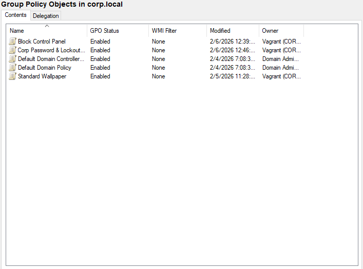

# Project: AD-002-Group-Policy-Management
**Date:** February 2026
**Platform:** Windows Server 2022 (Group Policy Management Console)

## 1. Project Overview
Following the user population phase, this project focused on **Centralized Configuration Management**. I utilized Group Policy Objects (GPOs) to enforce security baselines, standard corporate branding, and strict Identity Security protocols across the `corp.local` domain. The primary objective was to demonstrate "One-to-Many" management: applying rules that automatically enforce compliance on endpoints (Windows 10) without manual intervention.

## 2. Policy Objectives
* **Corporate Branding:** Enforce a standardized desktop background for all employees to demonstrate the "User Configuration" pipeline.
* **Endpoint Hardening:** Disable access to the Control Panel and Settings app to simulate a restricted "Kiosk" or secured workstation environment.
* **Identity Security:** Implement strict Password Complexity and Account Lockout policies to defend against Brute Force attacks.

## 3. Configuration Details



### Policy A: "Standard Wallpaper"
* **Target Scope:** `OU=Employees` (Applies to all regular users).
* **GPO Setting:**
    * *Path:* User Configuration > Admin Templates > Desktop > Desktop > Desktop Wallpaper.
    * *Value:* `\\dc01\Share\wallpaper.jpg` (Style: Fill).
* **Result:** Users receive the corporate background immediately upon login.
* **Troubleshooting:** Required creating a network share (`\\dc01\Share`) with `Read` permissions for "Everyone" so clients could access the image file.

### Policy B: "Block Control Panel"
* **Target Scope:** `OU=Employees`.
* **GPO Setting:**
    * *Path:* User Configuration > Admin Templates > Control Panel > Prohibit access to Control Panel and PC settings.
    * *State:* Enabled.
* **Result:** When a targeted user attempts to open `Settings.exe` or `Control.exe`, the process is terminated by the OS, and an administrative restriction notification is displayed.

### Policy C: "Corp Password & Lockout"
* **Target Scope:** Domain Root (`corp.local`).
* **Precedence:** Link Order 1 (Overriding Default Domain Policy).
* **Settings (Computer Configuration > Security Settings > Account Policies):**
    * **Lockout Threshold:** 3 Failed Attempts.
    * **Lockout Duration:** 30 Minutes.
    * **Password History:** Remember last 24 passwords.
    * **Max Password Age:** 90 Days.
* **Verification:**
    * Validated "King of the Hill" status using `Get-ADDefaultDomainPasswordPolicy` to ensure the custom policy values were active.
    * Simulated a brute-force attack on `Client01` which successfully locked the account after 3 invalid attempts.

## 4. Reference Guide: Admin Commands

### Check Effective Password Policy (The "Truth" Check)
```powershell
Get-ADDefaultDomainPasswordPolicy
```

### Unlock a Locked User Account
```powershell
Unlock-ADAccount -Identity "James.Smith"
```

### Force a Policy Update on a Client
```powershell
gpupdate /force
```

### Generate a GPO Report (HTML)
```powershell
Get-GPOReport -Name "Corp Password & Lockout Policy" -ReportType HTML -Path "C:\Report.html"
```