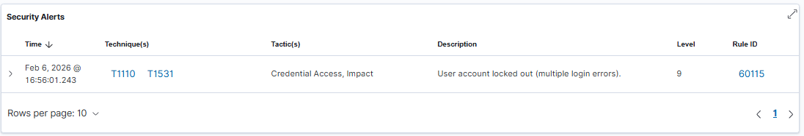
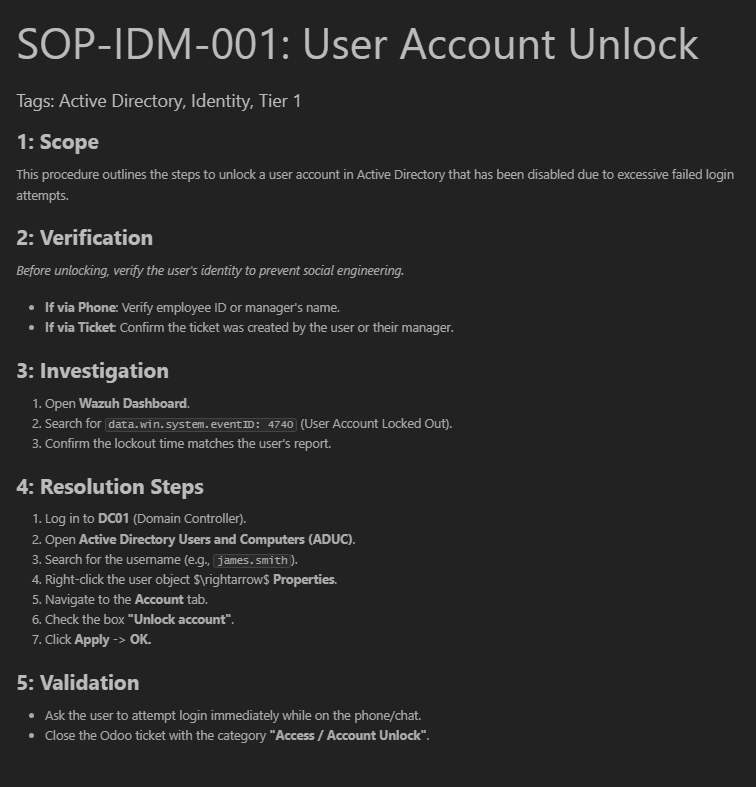
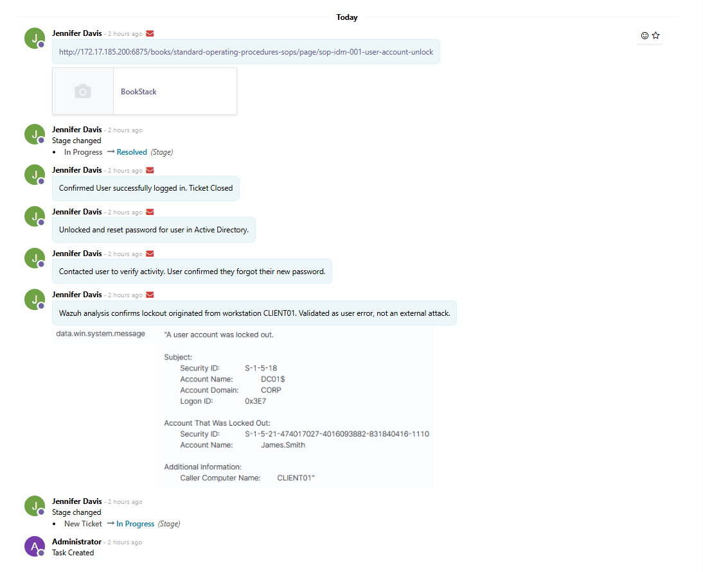

# Lab Report: AD-005 - IT Helpdesk Ticketing Simulation
**Date:** February 2026
**Platform:** Windows Server 2022, RSAT (Windows 10), Odoo

### 1. Scenario Overview
* **User:** James Smith (VIP User / Finance Dept)
* **Issue:** User reported inability to log in to their workstation.
* **Environment:**
    * **Identity Provider:** Windows Server 2022 Active Directory (`CORP.LOCAL`)
    * **ERP/Ticketing:** Odoo v16 (Project/Helpdesk Module)
    * **Workstation:** Windows 10 Enterprise (`CLIENT01`)
    * **Security Tool:** Wazuh SIEM (Monitoring Login Failures)

### 2. Issue Simulation & Verification
The "Account Lockout" policy was triggered on the Domain Controller to replicate a security event where a user attempts too many incorrect passwords.

* **Evidence:** The user attempted to authenticate, resulting in a specific security error message confirming the account status in Active Directory.

> **Exhibit A: User Lockout Message**
>
> 
>
>*Figure 1: Workstation error message explicitly stating "The referenced account is currently locked out."*

### 3. Incident Management (Ticketing)
Upon verification of the user's identity, a support ticket was generated in the central ERP system (Odoo) to track the incident lifecycle.

* **Workflow Configured:**
    * **New Ticket:** Incoming requests.
    * **In Progress:** Active troubleshooting.
    * **Resolved:** Verified fixes.

> **Exhibit B: Helpdesk Pipeline**
> 
> *Figure 2: The IT Helpdesk Kanban board configured with standard support stages.*

* **Ticket Details:**
    * **Subject:** `User Locked Out - James Smith`
    * **Priority:** High (Work Stoppage)
    * **Assignee:** Jennifer Davis (IT Support)

> **Exhibit C: Ticket Documentation**
> 
> *Figure 3: The active ticket record containing the user's initial report and triage details.*

### 4. Investigation & Resolution Workflow
To ensure security compliance, the resolution followed a strict **Verify $\rightarrow$ Analyze $\rightarrow$ Remediate** workflow rather than a simple password reset.

1.  **SIEM Analysis (Wazuh):**
    * Retrieved logs confirming Event ID 4740 (Account Lockout).
    * **Finding:** Lockout originated from `CLIENT01`, ruling out external brute-force attacks.
    
2.  **User Verification:**
    * Contacted James Smith to confirm the activity.
    * **Outcome:** User admitted to forgetting their new password; validated as user error.
3.  **Remediation:**
    * Unlocked account in Active Directory and guided user through password reset policy.
4.  **SOP Adherence:**
    * Linked the relevant Standard Operating Procedure (SOP) to the ticket for audit trails.
    * Closed ticket only after user confirmed successful login.
    

> **Exhibit D: Investigation Log & SOP Compliance**
> 
> *Figure 4: Detailed activity log showing Wazuh analysis, user verification, and the link to the internal SOP (Standard Operating Procedure).*

### 5. Conclusion
This lab demonstrates the integration between **Technical Execution** (AD Administration) and **Business Process** (ERP Ticketing). The workflow mimics real-world SOC standards where every administrative action must be justified by forensic evidence (Wazuh logs) and user verification before execution.