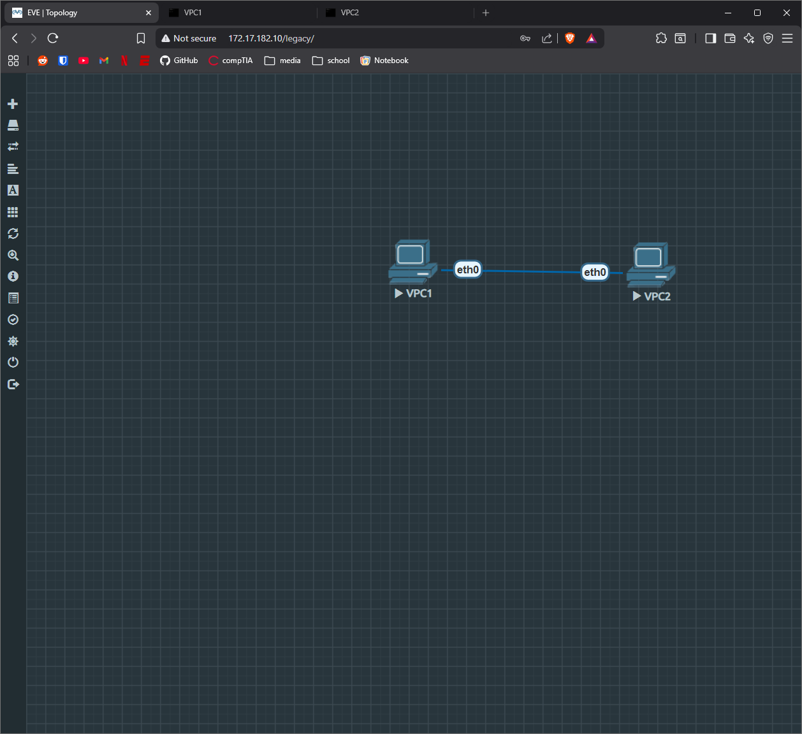

# NETWORK-001: Basic Connectivity & VPCS Setup

**Date:** 2026-01-30
**Lab Environment:** EVE-NG Community Edition

## 1. Purpose
To validate the EVE-NG installation and establish basic Layer 2 connectivity between two Virtual PC nodes (VPCS). This lab serves as the "Hello World" verification for the virtual lab environment before attempting complex Cisco IOS routing.

## 2. Topology
Two Virtual PCs connected via a single Ethernet link (Ethernet0 <-> Ethernet0) on the 192.168.1.0/24 subnet.



## 3. Configuration Steps

### IP Addressing
Assigned static IP addresses to both nodes using the VPCS command line.

**VPC1:**
```bash
ip 192.168.1.1/24
```

**VPC2:**
```bash
ip 192.168.2.2/24
```

**Result:** Success: 5/5 packets received with <1ms latency.

