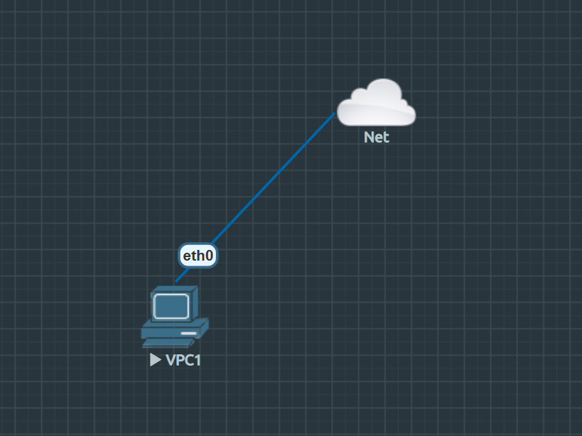

# NETWORK-002: DHCP & Internet Access

**Date:** 2026-01-31
**Lab Environment:** EVE-NG Community Edition

## 1. Purpose
To validate external connectivity by connecting a Virtual PC (VPCS) to the Management Cloud interface. This lab tests the ability of virtual nodes to pull dynamic IP addresses via DHCP from the external physical network and establishes the "Bridge" required for future package updates and internet access.

## 2. Topology
Single Virtual PC connected directly to the Management (Cloud0) interface, bridging it to the host machine's primary network adapter.
- **Node:** VPC1
- **Interface:** Ethernet0 -> Cloud0



## 3. Configuration Steps

### DHCP Request
Instead of static assignment, the VPC was configured to request an IP address from the upstream DHCP server (Home Router/ISP).

**VPC1:**
```bash
ip dhcp
```
## 4. Troubleshooting (Critical)
**Issue:** Initial `ip dhcp` attempts resulted in a timeout (DORA failure). The VPC sent "Discover" packets but never received an "Offer."

**Root Cause:** **Hyper-V MAC Address Spoofing.** By default, the Hyper-V virtual switch applies security policy that only allows traffic from the specific MAC address asigned to the EVE-NG VM. Since the nested VPCS generates its own random MAC address, Hyper-V dropped the outgoing packets as "unauthorized."

**Resolution:**
1. Shutdown the EVE-NG Virtual Machine.
2. Open **Hyper-V Manager** -> **Settings.**
3. Navigate to **Network Adapter** -> **Advanced Features.**
4. Enable **"Enable MAC address spoofing."**

## 5. Result
The DORA process compelted successfully.


