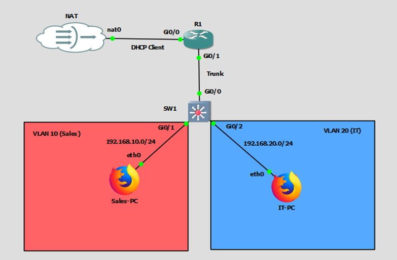

# Project: Enterprise Router-on-a-Stick Topology
**Date:** February 2026
**Platform:** GNS3 (Cisco IOSv & IOSvL2)

## 1. Project Overview
This lab simulates a Small-to-Medium Business (SMB) network using a "Router-on-a-Stick" (ROAS) architecture. The design segments traffic into two distinct Departments (Sales & IT) using VLANs, while a single Edge Router handles Inter-VLAN routing, DHCP services, and Network Address Translation (NAT) for internet access.

## 2. Topology Design
* **Edge Router (R1):** Cisco IOSv acting as the Default Gateway, DHCP Server, and NAT boundary.
* **Core Switch (SW1):** Cisco IOSvL2 providing Layer 2 segmentation.
* **End Points:**
    * **Sales-PC (VLAN 10):** Subnet `192.168.10.0/24`
    * **IT-PC (VLAN 20):** Subnet `192.168.20.0/24`
* **WAN Connection:** NAT Cloud bridging the virtual lab to the physical internet.

## 3. Configuration Details

### A. Switch Configuration (Layer 2)
* **VLAN Database:** Created `VLAN 10 (SALES)` and `VLAN 20 (IT)`.
* **Access Ports:**
    * `Gi0/1` assigned to VLAN 10.
    * `Gi0/2` assigned to VLAN 20.
* **Trunk Port:** `Gi0/0` configured with `encapsulation dot1q` to carry tagged traffic for both VLANs to the router.

### B. Router Configuration (Layer 3)
* **WAN Interface (Gi0/0):** Configured as a DHCP Client to receive an uplink IP from the ISP (Home Network).
* **ROAS (Router-on-a-Stick):**
    * Physical interface `Gi0/1` enabled (no IP).
    * **Sub-interface Gi0/1.10:** Encapsulation Dot1Q 10, IP `192.168.10.1`.
    * **Sub-interface Gi0/1.20:** Encapsulation Dot1Q 20, IP `192.168.20.1`.
* **DHCP Services:**
    * Configured two DHCP pools (`SALES_POOL`, `IT_POOL`).
    * Excluded Gateway IPs (`.1`) to prevent conflicts.
    * Pushing DNS Server `8.8.8.8` to clients.
* **NAT (Network Address Translation):**
    * Configured **PAT (Overload)** to allow multiple internal private IPs to share the single public WAN IP.
    * ACL 1 permits subnets `10.0` and `20.0` to access the internet.

### C. Device Hardening (Best Practices)
* **Console/VTY:** Set `exec-timeout 0 0` and `logging synchronous` for uninterrupted administration.
* **Domain Lookup:** Disabled to prevent CLI latency on typos.
* **Config Persistence:** All running configurations saved to startup-config (`write memory`).

## 4. Verification & Testing
* **Internal Connectivity:** Confirmed via successful ICMP Echo (Ping) between Sales-PC and IT-PC.
* **External Connectivity:** Confirmed via `ping 8.8.8.8` from internal VLANs.
* **DNS Resolution:** Confirmed web browsing (Firefox) capability on Webterms.