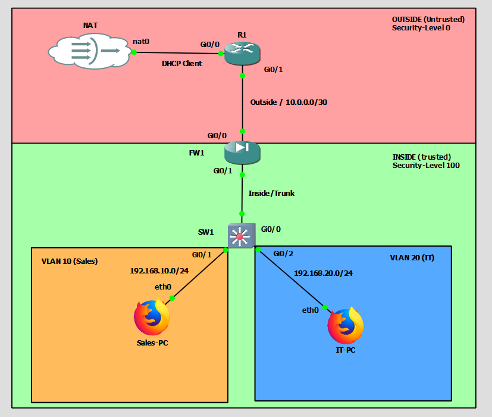

# Project: NET-004-Edge-Firewall-Topology
**Date:** February 2026
**Platform:** GNS3 (Cisco IOSv, IOSvL2, & ASAv)

## 1. Project Overview
This lab represents a significant security evolution from the previous "Router-on-a-Stick" design (NET-003). The architecture migrates the Default Gateway and DHCP services from the edge router to a dedicated **Cisco ASAv Firewall**. This creates a "Defense in Depth" strategy, establishing distinct "Trusted" (Inside) and "Untrusted" (Outside) security zones with stateful packet inspection.

## 2. Topology Design
* **Edge Router (R1):** Acts as the "ISP Edge," handling the WAN uplink and routing traffic between the internet and the Firewall.
* **Firewall (FW1):** Cisco ASAv acting as the Security Boundary, Internal Gateway, DHCP Server, and primary NAT point.
* **Core Switch (SW1):** Cisco IOSvL2 providing Layer 2 segmentation and trunking to the Firewall.
* **Zones:**
    * **Outside Zone (SecLvl 0):** The transit network between R1 and FW1 (`10.0.0.0/30`).
    * **Inside Zone (SecLvl 100):** The internal trusted VLANs (`192.168.x.x`).

## 3. Configuration Details

### A. Firewall Configuration (Cisco ASAv)
* **Interfaces & Zones:**
    * **Outside (Gi0/0):** IP `10.0.0.2/30`, Security Level 0 (Untrusted).
    * **Inside (Gi0/1):** Physical trunk interface.
    * **Sub-interfaces:** `Gi0/1.10` (Sales) and `Gi0/1.20` (IT) configured with Security Level 100 (Trusted).
* **NAT (Network Address Translation):**
    * Configured **Dynamic Object NAT** to mask internal subnets (`192.168.10.0/24` & `20.0/24`) behind the Outside interface IP.
* **DHCP Services:**
    * Migrated DHCP responsibilities from R1 to FW1.
    * Created scopes `INSIDE_SALES` and `INSIDE_IT` to issue IPs and DNS (`8.8.8.8`) to clients.
* **Policy & Inspection:**
    * Enabled **ICMP Inspection** on the global policy map to permit ping traffic for troubleshooting.

### B. Router Configuration (Edge R1)
* **Destruction & Cleanup:** Removed previous ROAS sub-interfaces to prevent IP conflicts.
* **Routing:** Added **Static Routes** pointing to the Firewall (`10.0.0.2`) for internal subnets (`192.168.10.0` & `20.0`).
* **Transit Link:** Configured `Gi0/1` with IP `10.0.0.1/30` to connect to the Firewall's Outside interface.
* **ACL Updates:** Updated Access Control Lists to permit the Firewall's WAN IP to access the internet.

### C. Switch Configuration (Layer 2)
* **Trunking:** Updated the uplink port (`Gi0/0`) to trunk VLANs to the Firewall instead of the Router.
* **VLAN Database:** Maintained `VLAN 10 (SALES)` and `VLAN 20 (IT)` segmentation.

## 4. Challenges & Troubleshooting
* **ASAv Boot Loop:** Resolved a virtualization issue where the firewall hung at boot by changing the GNS3 QEMU CPU settings to `Host` mode.
* **ARP Caching:** Cleared stale ARP entries on endpoints to force discovery of the new Firewall MAC address as the Gateway.
* **ICMP Blocking:** Overcame the ASA's default behavior of blocking ping replies by modifying the `policy-map global_policy`.

## 5. Verification & Testing
* **End-to-End Connectivity:** Validated that Sales-PC and IT-PC can ping `8.8.8.8` through the Firewall and Router.
* **Stateful Inspection:** Verified that traffic is allowed from Inside -> Outside but blocked from Outside -> Inside (by default).
* **Web Browsing:** Confirmed full HTTP/HTTPS access on Webterms via Firefox.