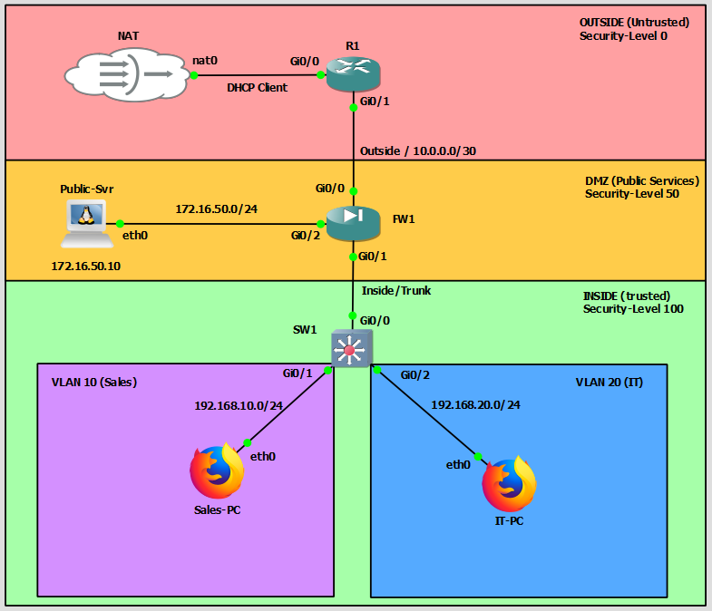

# Project: NET-005-DMZ-Public-Services
**Date:** February 2026
**Platform:** GNS3 (Cisco ASAv, IOSv, & Network Automation Container)

## 1. Project Overview
Building upon the edge firewall foundation (NET-004), this project evolves the network into a **"Three-Legged" Firewall Architecture**. I introduced a **Demilitarized Zone (DMZ)** to securely host public-facing services. This design enables critical business operations (hosting a public web server) while maintaining a strict "Air Gap" between the public internet and the sensitive internal network.

## 2. Topology Design
* **Firewall (FW1):** The central security appliance now managing flows between three distinct security zones.
* **Web Server (DMZ-Web):** A Linux-based **Network Automation** container hosting a Python HTTP server.
* **Zones & Security Levels:**
    * **Inside Zone (SecLvl 100):** Trusted Employee LAN (`192.168.x.x`).
    * **DMZ Zone (SecLvl 50):** Semi-Trusted Public Server Zone (`172.16.50.0/24`).
    * **Outside Zone (SecLvl 0):** Untrusted Internet (`10.0.0.0/30`).

## 3. Configuration Details

### A. Firewall Configuration (Cisco ASAv)
* **Interface Configuration:**
    * Activated `Gi0/2` as the **DMZ Interface**.
    * Assigned IP `172.16.50.1` with **Security Level 50**.
* **Static NAT (Port Forwarding):**
    * Configured a **Static Identity NAT** rule to map traffic hitting the Outside interface IP on **Port 80** to the internal DMZ server IP (`172.16.50.10`).
    * *Command:* `nat (DMZ,OUTSIDE) static interface service tcp 80 80`.
* **Access Control Lists (The "Hole Punch"):**
    * Created an extended ACL (`OUTSIDE_IN`) to strictly permit **TCP Port 80** traffic from `ANY` source to the DMZ Web Server.
    * Applied the ACL to the Outside interface in the ingress direction.

### B. Server Configuration (Linux/Python)
* **Node Selection:** Migrated from a basic Webterm to the **Network Automation** container to utilize advanced scripting tools and persistent configuration.
* **IP Addressing:** Configured a persistent static IP (`172.16.50.10`) and default gateway in `/etc/network/interfaces` to ensure the server survives reboots.
* **Service Deployment:**
    * Deployed a lightweight web server using Python 3's built-in http module.
    * *Command:* `python3 -m http.server 80`.

## 4. Challenges & Troubleshooting
* **Tooling Limitations:** The initial "Webterm" node lacked the necessary diagnostic tools (`netstat`, `python`) to simulate a listening server.
    * *Solution:* Pivoted strategy. I first verified connectivity using a Cisco Router as a mock server, then upgraded to the "Network Automation" container for a robust Linux environment.
* **Asymmetric Routing:** Initial tests failed because the Web Server had an IP but no Default Gateway, causing it to drop reply packets to the internet.
    * *Solution:* Configured the Linux routing table (`ip route add default via...`) to point back to the Firewall's DMZ interface.
* **Disaster Recovery:** Experienced a lab crash/restart which cleared unsaved configurations.
    * *Lesson:* Reinforced the critical habit of saving running-configs (`wr mem`) immediately after verification and using persistent config files for Linux nodes.

## 5. Verification & Testing
* **Inbound Public Access:** Validated that the external Router (R1) could successfully `telnet` to the Firewall's public IP on Port 80 and receive an "Open" connection status from the internal DMZ server.
* **Security Zone Validation:** Confirmed that the DMZ server could access the internet (for updates) but was explicitly blocked from initiating connections to the Inside (Trusted) network, preserving the security model.