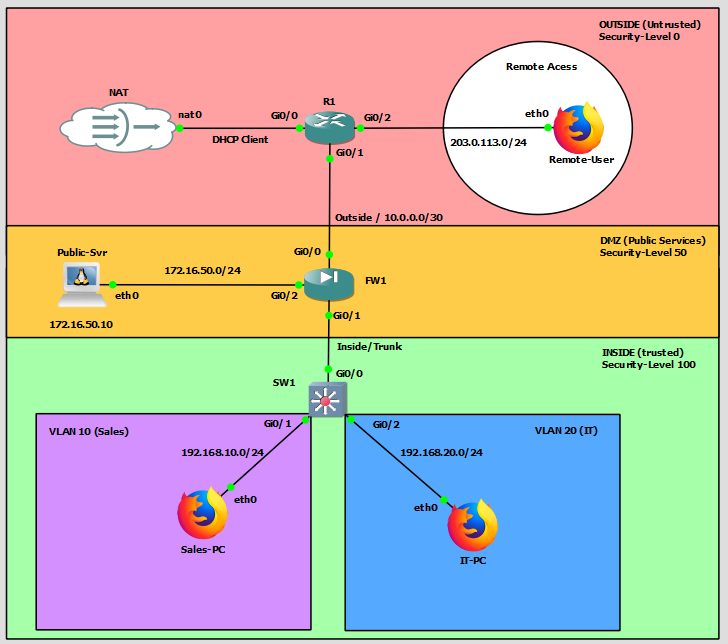

# Project: NET-006-Clientless-SSL-VPN
**Date:** February 2026
**Platform:** GNS3 (Cisco ASAv)
**Status:** Configuration Validated / Functional Testing Limited (Licensing)

## 1. Project Overview
The goal of this lab was to implement a **Clientless SSL VPN (WebVPN)** portal to allow remote users to access internal resources (HTTP/CIFS) using only a web browser, without installing software clients. This simulates a "Work from Home" or "Coffee Shop" remote access scenario.

## 2. Topology Changes
* **Remote User Node:** Added a "Coffee Shop" environment (`Remote-User`) connected to the ISP Router (R1) on the `203.0.113.0/24` public subnet.
* **Routing:** Verified end-to-end IP connectivity from the Remote User to the Firewall Outside interface (`10.0.0.2`).

## 3. Configuration Details

### A. Identity Management
* Created a local user database entry `VPNUSER` for authentication.
* *Command:* `username VPNUSER password [HIDDEN] privilege 0`

### B. WebVPN (SSL) Service
* Enabled the WebVPN service on the Outside (Public) interface.
* *Command:* `webvpn -> enable outside`

### C. Group Policy & Attributes
* Defined a specific Group Policy `CLIENTLESS_POLICY` to manage VPN permissions.
* Attempted to force **Clientless (Browser-only)** mode to bypass the need for the AnyConnect software client.
* *Command:* `anyconnect ask none default webvpn` (Intended to force the portal to load immediately).

## 4. Challenges & Hardware Constraints
* **The Licensing Wall:** The specific ASAv virtual image used in this lab environment is running in an **Unlicensed State**.
* **Feature Unavailability:** When attempting to enable the `ssl-clientless` protocol, the device returned an `% Unrecognized command` error. This confirms the image lacks the code base for the Web Portal feature.
* **Symptom:** The login page loads successfully (confirming SSL connectivity), but post-login fails with *"AnyConnect is not enabled on the VPN server"* because the device defaults to the Software Client mode and cannot switch to the Web Portal.

## 5. Conclusion
Despite the licensing limitation preventing the final portal render, the **Control Plane** was successfully established:
1.  **SSL Handshake:** Successful (HTTPS Login Page loads).
2.  **Authentication:** Successful (User credentials accepted).
3.  **Routing:** Successful (Remote node reached Public IP).

**Next Steps:** Proceed to **NET-007 (Site-to-Site VPN)**, which utilizes standard IPsec protocols supported by the base license.