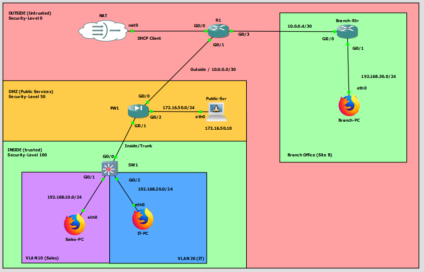

# Project: NET-007-Zone-Based-FW-VPN
**Date:** February 2026
**Platform:** GNS3 (Cisco ASAv, Cisco IOS Routers)
**Status:** Validated / Fully Functional

## 1. Project Overview
The goal of this lab was to implement a secure **Zone-Based Firewall** architecture using a Cisco ASA to segment traffic between Trusted (Inside), Untrusted (Outside), and Public (DMZ) networks. Additionally, a **Site-to-Site IPsec VPN** was established to provide secure, encrypted connectivity between the HQ Inside network and a Remote Branch office.

## 2. Topology Changes
* **Zone Segmentation:** Traffic is now strictly enforced based on Security Levels:
    * **Outside (Sec-Level 0):** Connected to ISP Router (R1) and the Internet.
    * **DMZ (Sec-Level 50):** Hosted services (Public-Svr at `172.16.50.10`).
    * **Inside (Sec-Level 100):** Internal LANs segmented by **VLAN 10 (Sales)** and **VLAN 20 (IT)** via a Trunk link to SW1.
* **Remote Branch:** A new site (`Branch-Rtr`) was added on the WAN side to simulate a remote office (`192.168.30.0/24`) requiring VPN access to HQ.

## 3. Configuration Details

### A. Interface & VLAN Configuration
* **Sub-interfaces:** Configured `Gi0/0` (Inside) with 802.1Q encapsulation to support VLAN 10 (Sales) and VLAN 20 (IT).
* **Security Levels:** Applied distinct security levels to allow implicit "High to Low" traffic flow while blocking "Low to High" by default.

### B. Site-to-Site VPN (IKEv1 / IPsec)
* **Protocol:** Configured IKEv1 (Main Mode) with a Pre-Shared Key (PSK) for authentication.
* **Encryption:** Used AES-256 for encryption and SHA for hashing (Transform Set).
* **Access Lists:** Defined "Interesting Traffic" ACLs to match traffic between HQ Subnets (`192.168.20.0/24`) and Branch Subnets (`192.168.30.0/24`).

### C. NAT & NAT Exemption
* **Dynamic NAT (PAT):** Configured for general internal traffic accessing the internet.
* **NAT Exemption (No-NAT):** Critical configuration added to prevent VPN traffic from being translated to the Public IP.
* *Command:* `nat (INSIDE_IT,OUTSIDE) source static INTERNAL_LAN INTERNAL_LAN destination static BRANCH_LAN BRANCH_LAN`

## 4. Challenges & Troubleshooting Lessons
* **The "Naked Packet" Issue (`ipsec-spoof`):**
    * *Symptom:* Firewall dropped incoming packets from Branch with error `ipsec-spoof`.
    * *Cause:* The Branch Router was sending packets unencrypted because its ACL didn't match the specific traffic flow.
    * *Fix:* Updated Branch Router ACL to explicitly permit traffic to HQ subnets.
* **NAT Conflicts:**
    * *Symptom:* VPN tunnel established (Phase 1 & 2 up), but ping replies from HQ failed to encrypt (`#pkts encaps: 0`).
    * *Cause:* Reply traffic was hitting the default Internet NAT rule instead of the VPN tunnel.
    * *Fix:* Configured explicit **Identity NAT** (NAT Exemption) for both Sales and IT VLANs.
* **Dynamic IP Mismatch:**
    * *Symptom:* Firewall could not deliver decrypted traffic to the endpoint.
    * *Cause:* The IT-PC held a DHCP address (`.50`) while the Firewall object pointed to a static IP (`.10`).
    * *Fix:* Updated the Network Object to match the actual host IP.

## 5. Conclusion
The lab was successful. We verified bidirectional connectivity:
1.  **Phase 1 & 2:** Tunnels are Active.
2.  **Encapsulation:** Confirmed bidirectional traffic flow (Encaps/Decaps counters increasing).
3.  **Latency:** Ping response times are consistent at ~6ms.

**Next Steps:** Proceed to **NET-008 (Remote Access VPN / AnyConnect)** or **DMZ Server Hardening**.